# 📚 JSAA - Joint Seat Allocation Authority Admin Dashboard

> **Complete Documentation for the JSAA Admin Panel - Your Ultimate College Counseling Management System**

---

## 📋 Table of Contents

1. [Overview](#overview)
2. [Technology Stack](#technology-stack)
3. [Getting Started](#getting-started)
4. [Available Pages & Features](#available-pages--features)
   - [Admin Dashboard](#1-admin-dashboard)
   - [College Management](#2-college-management)
   - [Exam Management](#3-exam-management)
   - [JOSAA Predictions](#4-josaa-predictions)
   - [TNEA Predictions](#5-tnea-predictions)
   - [Data Analysis](#6-data-analysis)
   - [User Management](#7-user-management)
5. [How to Upload Data](#how-to-upload-data)
6. [How to Edit & Add Records](#how-to-edit--add-records)
7. [Filtering & Searching](#filtering--searching)
8. [Export & Download](#export--download)
9. [Backend API Reference](#backend-api-reference)
10. [Available Features Summary](#available-features-summary)

---

## Overview

JSAA (Joint Seat Allocation Authority) Admin Dashboard is a comprehensive web application designed to manage college admissions data, entrance exams, and provide intelligent college predictions based on student ranks. This system supports:

- **College Management** - IIT, NIT, IIIT, and GFTI institutions
- **Exam Management** - National and State level entrance examinations
- **Prediction Systems** - JOSAA and TNEA rank-based college predictions
- **Data Analysis** - Upload, filter, visualize, and export data
- **User Analytics** - Track user engagement and system metrics

---

## Technology Stack

| Category | Technology |
|----------|------------|
| **Frontend** | Next.js 15, React 19, TypeScript |
| **Styling** | Tailwind CSS v4, Shadcn-ui |
| **Authentication** | Clerk |
| **State Management** | Zustand |
| **Tables** | Tanstack Data Tables, DnD-kit (drag & drop) |
| **Forms** | React Hook Form + Zod validation |
| **Charts** | Recharts |
| **Backend** | Python FastAPI |
| **Database** | Supabase |

---

## Getting Started

### Prerequisites
- Node.js 18+
- pnpm package manager
- Python 3.8+ (for backend)

### Installation

```bash
# Clone the repository
git clone [repository-url]

# Install frontend dependencies
pnpm install

# Create environment file
cp env.example.txt .env.local
# Add required environment variables

# Start frontend
pnpm run dev

# Start Python backend (in /back directory)
cd back
python app.py
```

Access the application at: `http://localhost:3000`

---

## Available Pages & Features

### 1. Admin Dashboard
**Path:** `/admin`

The main administrative overview page featuring:

| Feature | Description |
|---------|-------------|
| **Key Metrics Cards** | Total Users, Total Colleges, Active Exams, Predictions Count |
| **User Activity Charts** | Interactive charts showing exams, predictions, colleges, and NLP chat trends |
| **Popular Colleges** | Ranked list of most viewed institutions |
| **Prediction Analytics** | Success rate visualization with pie/radial charts |
| **Recent Activity** | Timeline of system activities |
| **Upcoming Tasks** | Admin task reminders |

**Charts Available:**
- Stacked Area Chart (User Activity Trends)
- Pie Chart (Prediction Success Rate)
- Bar Chart (Popular Colleges by Views)

---

### 2. College Management
**Path:** `/admin/colleges`

Comprehensive management of educational institutions across four categories:

| Institution Type | Description |
|-----------------|-------------|
| **IIT** | Indian Institutes of Technology |
| **NIT** | National Institutes of Technology |
| **IIIT** | Indian Institutes of Information Technology |
| **GFTI** | Government Funded Technical Institutions |

#### Features:

| Feature | How to Use |
|---------|------------|
| **View All Colleges** | Click "All" card to see complete list |
| **Filter by Type** | Click IIT/NIT/IIIT/GFTI cards |
| **Search** | Use search box to find by name/type |
| **Add New College** | Click "Add New College" button → Navigate to `/admin/colleges/add` |
| **Edit College** | Click pencil ✏️ icon on any row |
| **Delete College** | Click trash 🗑️ icon (confirmation required) |
| **Drag & Drop Reorder** | Grab the grip icon ⋮⋮ to reorder rows |
| **Pagination** | Use rows per page dropdown (5/10/20/30/50) or enter custom |

#### College Data Fields:
- College Name
- Type (IIT/NIT/IIIT/GFTI)
- Tier
- NIRF 2024 Ranking
- Establishment Year
- B.Tech Seats
- B.Tech Programmes
- Website URL

#### Navigation:
- **Add College:** `/admin/colleges/add`
- **Edit College:** `/admin/colleges/[id]/edit/[type]`
- **View College:** `/admin/colleges/[id]/[type]`

---

### 3. Exam Management
**Path:** `/admin/exams`

Manage entrance examinations database with full CRUD capabilities:

#### Exam Types:
- **National Level** - JEE Main, JEE Advanced, BITSAT, etc.
- **State Level** - TNEA, KCET, WBJEE, etc.

#### Features:

| Feature | How to Use |
|---------|------------|
| **View All Exams** | Default view shows all exams |
| **Filter by Level** | Click "National Level" or "State Level" cards |
| **Search Exams** | Search by name, code, type, or organizing body |
| **Add New Exam** | Click "Add New Exam" button |
| **Edit Exam** | Click pencil ✏️ icon → Opens edit form |
| **Delete Exam** | Click trash 🗑️ icon → Confirm deletion |
| **Drag & Drop Reorder** | Drag handle to reorder priority |
| **View Website** | Click "Link" to open official exam portal |

#### Exam Data Fields:
- Exam Name
- Exam Code
- Exam Type (National/State)
- Application Period
- Organizing Body
- Official Website
- Views Count

#### Navigation:
- **Add Exam:** `/admin/exams/add`
- **Edit Exam:** `/admin/exams/edit/[id]`
- **Exam List:** `/admin/exams/list`

---

### 4. JOSAA Predictions
**Path:** `/admin/predictions/josaa`

Intelligent JEE-based college prediction system for JOSAA counseling:

#### Dashboard Metrics:
- Total Predictor Users (5.2K+)
- Total Predictions Made (18.5K+)
- Predictor Status (Operational/Maintenance/Paused)
- Prediction Accuracy (97%)

#### Features:

| Feature | Description |
|---------|-------------|
| **2025 JEE Ranks Display** | Latest JEE Advanced & Main rank statistics |
| **Accuracy Radial Chart** | Visual display of model accuracy |
| **Average Rank Analytics** | Average and median rank predictions |
| **Predictions Over Time** | Line chart showing daily prediction counts |
| **Recent Predictions Table** | User-wise prediction results |
| **Closing Ranks Table** | Current college-wise closing ranks |

#### Advanced Predictor Tuning:

| Parameter | Description |
|-----------|-------------|
| **Accuracy Level** | Target accuracy percentage |
| **Prediction Temperature** | Model confidence adjustment (0.1-1.0) |
| **Confidence Threshold** | Minimum confidence for predictions |
| **Model Parameters (JSON)** | Custom weights for JEE Main/Advanced |
| **Status** | Operational / Maintenance / Paused |
| **Status Message** | Public-facing status message |

---

### 5. TNEA Predictions
**Path:** `/admin/predictions/tnea`

Tamil Nadu Engineering Admissions prediction system (Similar structure to JOSAA).

---

### 6. Data Analysis
**Path:** `/admin/analysis`

Powerful data analysis tool with Excel/CSV support:

#### Upload Capabilities:

| File Type | Support |
|-----------|---------|
| **CSV** | ✅ Full support |
| **Excel (.xlsx)** | ✅ Full support |
| **Excel (.xls)** | ✅ Full support |

#### Features:

| Feature | How to Use |
|---------|------------|
| **Upload Data** | Click "Select Data File" or drag & drop |
| **Row Range Control** | Use slider to select visible rows (0-1000) |
| **Column Range Control** | Use slider to select visible columns |
| **Global Search** | Search across all table data |
| **Basic Filters** | Click "Basic Filter" button |
| **Advanced Filters** | Click "Advanced" button |
| **Statistics** | Click "Stats" to view column statistics |
| **Export CSV** | Click "Export" to download filtered data |

#### Filter Types Available:

**Text Filters:**
- Contains / Does Not Contain
- Equals / Not Equals
- Starts With / Ends With
- Regex Pattern
- Is In List (comma-separated)

**Number Filters:**
- Greater Than (>)
- Less Than (<)
- Between (Range)

**Data Quality:**
- Is Empty
- Not Empty

#### Basic Filter Panel:
For each column, dynamically shows:
- **Text Columns:** Text input with "Strict" toggle (exact match)
- **Numeric Columns:** Min/Max inputs for range filtering

#### Visualization Options:

| Chart Type | Best For |
|------------|----------|
| **Bar Chart** | Categorical comparisons |
| **Line Chart** | Trends over time |
| **Pie Chart** | Distribution percentages |
| **Area Chart** | Cumulative trends |
| **Scatter Chart** | Correlation analysis |
| **Treemap** | Hierarchical data |

#### Comparison Mode:
- Select a comparison column
- Choose two values to compare
- View side-by-side charts and tables
- Show differences only toggle

---

### 7. User Management
**Path:** `/admin/users`

Manage registered users and their access:

- **View All Users:** `/admin/users/all`
- **View User Details:** `/admin/users/[userId]`

---

## How to Upload Data

### Method 1: Analysis Page (Excel/CSV)

1. Navigate to `/admin/analysis`
2. Click **"Select Data File"** or drag & drop
3. Supported formats: `.csv`, `.xlsx`, `.xls`
4. System auto-detects headers
5. Data appears in interactive table

### Method 2: College/Exam Forms

1. Navigate to respective management page
2. Click **"Add New"** button
3. Fill required form fields
4. Click **"Submit"** to save

---

## How to Edit & Add Records

### Adding Records:

| Entity | Path | Action |
|--------|------|--------|
| College | `/admin/colleges/add` | Click "Add New College" |
| Exam | `/admin/exams/add` | Click "Add New Exam" |

### Editing Records:

1. Navigate to the management page
2. Locate the record in the table
3. Click the **pencil ✏️ icon** in Actions column
4. Modify fields in the edit form
5. Click **"Save"** or **"Update"**

### Deleting Records:

1. Locate record in table
2. Click **trash 🗑️ icon**
3. Confirm deletion in popup dialog
4. Record is permanently removed

### Reordering Records:

1. Ensure drag handle (⋮⋮) is visible
2. Click and hold the drag handle
3. Drag to desired position
4. Release to save new order
5. Order is auto-saved to backend

---

## Filtering & Searching

### Global Search
Available on all management pages - searches across all visible columns.

### Quick Filters (Analysis Page)

```
For Text Columns:
┌─────────────────────────────────┐
│ Column Name                     │
│ [___Enter filter text___]       │
│ ☐ Strict (exact match)         │
└─────────────────────────────────┘

For Numeric Columns:
┌─────────────────────────────────┐
│ Column Name                     │
│ Min: [__] - Max: [__]          │
│ • One value = equals           │
│ • Both values = between        │
└─────────────────────────────────┘
```

### Advanced Filter Builder

1. Click **"Advanced"** button
2. **Step 1:** Select column to filter
3. **Step 2:** Choose filter type
4. **Step 3:** Enter filter value(s)
5. Click **"Add Filter"**
6. Multiple filters stack (AND logic)

---

## Export & Download

### CSV Export (Analysis Page)

1. Apply desired filters
2. Click **"Export"** button
3. Downloads `filtered_data.csv`
4. Contains only visible/filtered rows

### Backend Export Endpoint

```http
POST /download-data
Content-Type: application/json

{
  "df_id": "your-dataframe-id",
  "filter_type": "contains",
  "column": "Name",
  "value": "IIT"
}
```

---

## Backend API Reference

The Python FastAPI backend runs on port `8000` and provides:

### Analysis Endpoints

| Endpoint | Method | Description |
|----------|--------|-------------|
| `/upload` | POST | Upload Excel/CSV file |
| `/dataframe/{df_id}` | GET | Get dataframe info |
| `/filter` | POST | Apply filters to data |
| `/visualize` | POST | Generate chart data |
| `/download-data` | POST | Export filtered data as CSV |

### College Endpoints

| Endpoint | Method | Description |
|----------|--------|-------------|
| `/api/iit` | GET | Get all IITs |
| `/api/nit` | GET | Get all NITs |
| `/api/iiit` | GET | Get all IIITs |
| `/api/gfti` | GET | Get all GFTIs |
| `/api/college/{id}/{type}` | GET | Get single college |
| `/api/college/{id}/{type}` | PUT | Update college |
| `/api/college/{id}/{type}` | DELETE | Delete college |
| `/api/update-college-order` | POST | Reorder colleges |

### Exam Endpoints

| Endpoint | Method | Description |
|----------|--------|-------------|
| `/exams` | GET | Get all exams |
| `/exams/{id}` | GET | Get single exam |
| `/exams` | POST | Create exam |
| `/exams/{id}` | PUT | Update exam |
| `/exams/{id}` | DELETE | Delete exam |
| `/update-exam-order` | POST | Reorder exams |

---

## Available Features Summary

### ✅ Completed Features

| Feature | Status | Location |
|---------|--------|----------|
| Admin Dashboard with Analytics | ✅ | `/admin` |
| College CRUD Operations | ✅ | `/admin/colleges` |
| College Type Filtering (IIT/NIT/IIIT/GFTI) | ✅ | `/admin/colleges` |
| Exam CRUD Operations | ✅ | `/admin/exams` |
| Exam Level Filtering (National/State) | ✅ | `/admin/exams` |
| Drag & Drop Reordering | ✅ | Colleges, Exams |
| JOSAA Predictor Dashboard | ✅ | `/admin/predictions/josaa` |
| JOSAA Predictor Tuning | ✅ | `/admin/predictions/josaa` |
| TNEA Predictor Dashboard | ✅ | `/admin/predictions/tnea` |
| Data Upload (Excel/CSV) | ✅ | `/admin/analysis` |
| Basic Column Filtering | ✅ | `/admin/analysis` |
| Advanced Filter Builder | ✅ | `/admin/analysis` |
| Multiple Chart Visualizations | ✅ | `/admin/analysis` |
| Data Export to CSV | ✅ | `/admin/analysis` |
| Row/Column Range Selection | ✅ | `/admin/analysis` |
| Data Comparison Mode | ✅ | `/admin/analysis` |
| Column Statistics | ✅ | `/admin/analysis` |
| Real-time Search | ✅ | All pages |
| Pagination with Custom Rows | ✅ | All tables |
| Dark Mode Support | ✅ | Global |
| Responsive Design | ✅ | Global |
| Clerk Authentication | ✅ | Global |

### 🔧 Supported Actions by Page

| Page | View | Add | Edit | Delete | Search | Filter | Export | Reorder |
|------|------|-----|------|--------|--------|--------|--------|---------|
| Colleges | ✅ | ✅ | ✅ | ✅ | ✅ | ✅ | ❌ | ✅ |
| Exams | ✅ | ✅ | ✅ | ✅ | ✅ | ✅ | ❌ | ✅ |
| JOSAA | ✅ | ❌ | ✅ (Tuning) | ❌ | ❌ | ❌ | ❌ | ❌ |
| Analysis | ✅ | ✅ (Upload) | ❌ | ❌ | ✅ | ✅ | ✅ | ❌ |
| Users | ✅ | ❌ | ❌ | ❌ | ❌ | ❌ | ❌ | ❌ |

---

## Quick Reference Card

```
┌─────────────────────────────────────────────────────────────┐
│                    JSAA ADMIN QUICK REFERENCE               │
├─────────────────────────────────────────────────────────────┤
│                                                             │
│  🏠 Dashboard:     /admin                                   │
│  🏫 Colleges:      /admin/colleges                          │
│  📝 Exams:         /admin/exams                             │
│  🎯 JOSAA:         /admin/predictions/josaa                 │
│  📊 Analysis:      /admin/analysis                          │
│  👥 Users:         /admin/users                             │
│                                                             │
│  ➕ Add College:   /admin/colleges/add                      │
│  ➕ Add Exam:      /admin/exams/add                         │
│                                                             │
│  🔧 Backend:       http://localhost:8000                    │
│  🌐 Frontend:      http://localhost:3000                    │
│                                                             │
│  📤 Upload Files:  Analysis page → Select Data File         │
│  📥 Export Data:   Analysis page → Export button            │
│                                                             │
└─────────────────────────────────────────────────────────────┘
```

---

## 🔄 Workflow Diagrams

### System Architecture Overview


---

### Complete User Journey Flow

```mermaid
flowchart LR
    subgraph Entry["🚪 Entry"]
        Login["Login via Clerk"]
    end

    subgraph Dashboard["📊 Dashboard"]
        Overview["View Analytics"]
        Metrics["Check Metrics"]
    end

    subgraph Management["🏫 Management"]
        Colleges["Manage Colleges"]
        Exams["Manage Exams"]
        Users["View Users"]
    end

    subgraph Predictions["🎯 Predictions"]
        JOSAA["JOSAA Predictor"]
        TNEA["TNEA Predictor"]
    end

    subgraph Analysis["📈 Analysis"]
        Upload["Upload Data"]
        Filter["Apply Filters"]
        Visualize["Create Charts"]
        Export["Export Results"]
    end

    Login --> Overview
    Overview --> Metrics
    Metrics --> Colleges
    Metrics --> Exams
    Metrics --> Users
    Metrics --> JOSAA
    Metrics --> TNEA
    Metrics --> Upload
    Colleges --> Filter
    Exams --> Filter
    Upload --> Filter
    Filter --> Visualize
    Visualize --> Export
```



---

### College/Exam CRUD Workflow


---

### Data Analysis Workflow


---

### JOSAA Prediction Flow

```mermaid
flowchart TD
    Start(["🎯 Student Enters Rank"]) --> InputRank["Enter JEE Rank/Percentile"]
    
    subgraph Input["📝 User Input"]
        InputRank --> JEEMain["JEE Main Percentile"]
        InputRank --> JEEAdv["JEE Advanced Rank"]
        JEEMain --> Category["Select Category"]
        JEEAdv --> Category
        Category --> Preferences["Select Branch Preferences"]
    end
    
    subgraph Processing["⚙️ Prediction Engine"]
        Preferences --> ValidateInput["Validate Inputs"]
        ValidateInput --> LoadModel["Load Prediction Model"]
        LoadModel --> ApplyWeights["Apply JEE Weights"]
        ApplyWeights --> QueryDatabase["Query Historical Data"]
        QueryDatabase --> CalculateProb["Calculate Probabilities"]
        CalculateProb --> RankColleges["Rank Eligible Colleges"]
    end
    
    subgraph Output["📊 Results"]
        RankColleges --> GenerateList["Generate College List"]
        GenerateList --> ShowPredicted["Display Predicted Colleges"]
        ShowPredicted --> ClosingRanks["Show Closing Ranks"]
        ClosingRanks --> Confidence["Display Confidence Score"]
    end
    
    subgraph Admin["👨‍💼 Admin Monitoring"]
        Confidence --> LogPrediction["Log Prediction"]
        LogPrediction --> UpdateMetrics["Update Dashboard Metrics"]
        UpdateMetrics --> TrackAccuracy["Track Accuracy"]
    end
    
    TrackAccuracy --> End(["✅ Prediction Complete"])
```



---

### Authentication & Authorization Flow


---

### Data Flow Architecture

```mermaid
flowchart LR
    subgraph Sources["📂 Data Sources"]
        Excel["Excel Files"]
        CSV["CSV Files"]
        Forms["Web Forms"]
        API_External["External APIs"]
    end
    
    subgraph Ingestion["📥 Data Ingestion"]
        Upload["File Upload"]
        FormSubmit["Form Submit"]
        APIFetch["API Fetch"]
    end
    
    subgraph Processing["⚙️ Processing Layer"]
        Parse["Parse & Validate"]
        Transform["Transform Data"]
        Filter["Apply Filters"]
        Aggregate["Aggregate Stats"]
    end
    
    subgraph Storage["💾 Storage Layer"]
        Supabase["Supabase DB"]
        Memory["In-Memory Store"]
        Cache["Cache Layer"]
    end
    
    subgraph Output["📤 Output Layer"]
        TableView["Table Display"]
        Charts["Visualizations"]
        CSVExport["CSV Export"]
        JSONResponse["JSON API"]
    end
    
    Excel --> Upload
    CSV --> Upload
    Forms --> FormSubmit
    API_External --> APIFetch
    
    Upload --> Parse
    FormSubmit --> Parse
    APIFetch --> Parse
    
    Parse --> Transform
    Transform --> Filter
    Filter --> Aggregate
    
    Aggregate --> Supabase
    Aggregate --> Memory
    Aggregate --> Cache
    
    Supabase --> TableView
    Memory --> Charts
    Cache --> CSVExport
    Supabase --> JSONResponse
```



---

### End-to-End Request Lifecycle


---

### Filter Processing Pipeline

```mermaid
flowchart TD
    RawData["📊 Raw Dataset"] --> Pipeline["Filter Pipeline"]
    
    subgraph Pipeline["🔧 Filter Processing"]
        direction TB
        Step1["1️⃣ Global Search Filter"]
        Step2["2️⃣ Basic Column Filters"]
        Step3["3️⃣ Advanced Filters"]
        Step4["4️⃣ Sort Operation"]
        Step5["5️⃣ Pagination Slice"]
        
        Step1 --> Step2
        Step2 --> Step3
        Step3 --> Step4
        Step4 --> Step5
    end
    
    Pipeline --> FilteredData["✅ Filtered Results"]
    
    subgraph FilterTypes["Filter Types Applied"]
        Text["Text: Contains, Equals, Regex"]
        Numeric["Numeric: Range, GT, LT"]
        Quality["Quality: Empty, Not Empty"]
    end
    
    Step3 -.-> FilterTypes
```



---

## Support

For issues or questions, please refer to the main project documentation or contact the development team.

---

**Last Updated:** December 2025  
**Version:** 1.1.0
